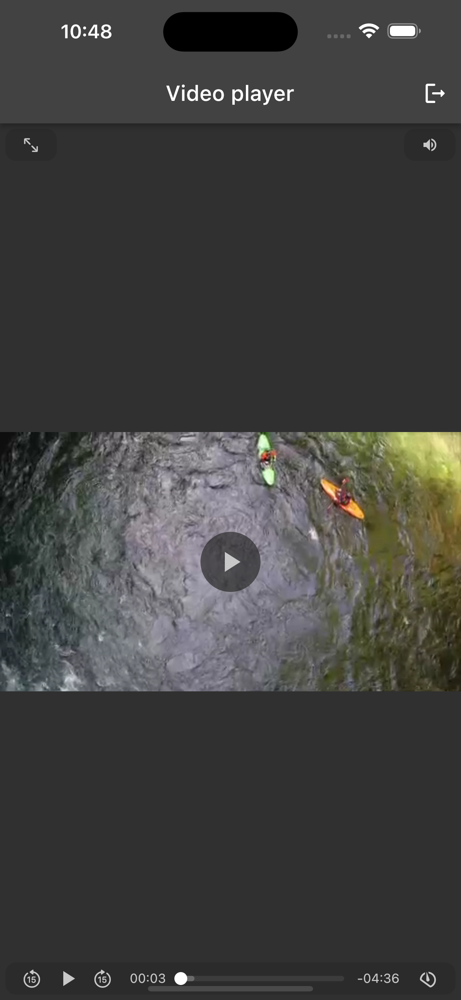

# Flutter Challenge - Yahoo Finance API

This mobile development technical test is focused on building an application aimed at the video 
surveillance context and that makes use of an API.

Challenge developed by Jonny Eduardo Banach on March 23th 2023.

### Applied concepts

- BLoC pattern;
- API calls;
- Error handling;
- Loading states;
- Unit testing (mockito);
- Video player (chewie);

### Building and running the app

1. Clone the repository on your computer.
2. Connect a smartphone to the computer or start a simulator/ADV (Android Virtual Device).
3. Go to the project's root folder in the terminal and enter these commands:  `flutter build apk` and `flutter install`.
4. Open the "Seventh Challenge" application.

### Running the tests

1. Clone the repository on your computer.
2. Go to the project's root folder in the terminal and enter this command: `flutter test test/unit_test/unit_test.dart`.

### Screenshots

| Description           | Image                                                |
|-----------------------|------------------------------------------------------|
| Login Screen (empty)  |        |
| Login Screen (filled) |       |
| Error State           |        |
| Loading State         |      | 
| Video playing         |      | 
| Video paused          |       | 
| Full Screen Video     |  |